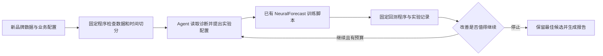

# 六个项目深读：Agent 如何辅助预测建模

更新：2026-09-17。用途：为已有 NeuralForecast 销售预测 baseline 寻找可借鉴的设计。本文是文档与论文调研，没有安装或运行这些系统。

## 先看哪些

| 项目与详细总结 | 为什么入选 | 最值得参考的部分 | 证据性质 |
|---|---|---|---|
| [TimeCopilot](deep-dives/01_timecopilot.md) | 与 NeuralForecast 接口最接近 | 将模型封装成工具，统一回测与解释 | 开源实现、官方文档、预测模型基准 |
| [Microsoft Finn](deep-dives/02_finn.md) | 企业预测流程参考价值高 | 首次建模、定期更新、退化后重新优化 | 企业开源项目、Agent 使用文档 |
| [TimeSeriesScientist](deep-dives/03_timeseriesscientist.md) | 完整时序分析流程 | 诊断、预处理、选模、集成、报告 | 开源研究实现、论文实验 |
| [AutoGluon Assistant / MLZero](deep-dives/04_mlzero.md) | 跨数据格式适配参考 | 文档检索、自动编程、错误记忆 | 企业参与的开源研究、综合 ML 基准 |
| [Microsoft RD-Agent](deep-dives/05_rdagent.md) | 适合长期实验管理 | 假设—实现—运行—反馈的迭代 | 企业开源研发框架、量化与通用数据科学示例 |
| [金融训练 TS-Agent](deep-dives/06_tsagent.md) | 与“已有训练脚本”高度相似 | 有约束地修改脚本，分阶段分配实验预算 | 论文；本次未确认官方可运行仓库 |

建议先读 TimeCopilot 和 Finn，再读 TS-Agent。前三者分别回答“怎么接模型”“怎么持续运营”“怎么围绕脚本做实验”。TS-Agent 的开源状态尚未确认，作为方法参考保留。

每篇按用户要求包含：**1、背景；2、问题；3、难点；4、实现方法；5、效果**。另外提供针对本项目的分析和原始出处。标记为“本项目分析／建议”的内容是本次调研者推导，不是原作者的实验结论。

## 效果应该怎样读

| 证据 | 能支持什么 | 不能据此推断什么 |
|---|---|---|
| TimeCopilot 的 GIFT-Eval | 指定基础模型集成在该基准上的表现与计算成本 | LLM 决策带来了同等幅度提升 |
| Finn 的 Agent API 和完整示例 | 已有可参考的建模与更新工作流 | 新 Agent 已经独立创造了微软历史上全部预测收益 |
| TSci 的 MAE/MAPE 实验 | 在论文数据、切分和对手下的结果 | 每个数据集、每个指标都最好 |
| MLZero 的任务完成率 | 自动生成并执行 ML 流程的成功程度 | 销售预测准确率为 92% |
| RD-Agent 的研发场景和基准 | 能把想法转成代码并使用实验反馈 | 已验证跨品牌销量预测提升 |
| TS-Agent 的金融实验 | 有约束的训练脚本迭代值得验证 | 已可直接接入零售数据并稳定取得同样收益 |

这些项目没有共同的数据、预算和基线，不能按宣传数字排列强弱。企业发布项目也不等于已经公开证明企业生产收益。

## 对当前项目的综合判断

以下是设计建议，尚未针对用户 baseline 验证。

最适合第一版的组合是：**TimeCopilot 式模型工具接口 + Finn 式更新规则 + TS-Agent 式实验记录**。暂时不需要训练一个新的大模型，也不需要先做强化学习。

这里 Agent 负责选择下一步；预测模型负责学习销量规律；固定评估程序负责判断优劣。三者有明确接口，才能分清究竟是哪一部分起作用。

可以优先验证四种能力：

1. **配置迁移**：新品牌到来后，自动生成字段映射、频率、预测长度和候选模型配置。业务口径由预先定义的配置确定。
2. **实验建议**：根据数据长度、缺失情况、残差和现有指标，提出下一组参数；每轮保留修改理由和结果。
3. **失败恢复**：区分格式错误、训练资源不足和效果不佳，采用不同处理方式。
4. **周期更新**：复用已确认的方案；只有满足退化条件时才开启额外搜索。

为了知道 Agent 是否值得做，后续比较应至少包含：原 baseline、固定规则加相同预算的调参、Agent 加相同预算的调参。除误差外，记录人工介入次数、人工耗时、训练费用、LLM 费用、失败率及较差品牌的表现。预算包括失败的实验，不能只计算成功候选。

跨品牌是否有效还需要分开检验：已有品牌的新时间段，以及完全未参与开发的新品牌。滚动回测用于选择配置，最终时间留出集只用于最后评估。业务特征必须注明预测当时是否可知，尤其是未来促销、价格与库存。

## 文献与版本说明

详细来源位于各篇末尾和 [本轮来源与核验记录](05_deep_dive_sources.md)。此前的广泛调研仍保留在 [总报告](01_report.md) 和 [56 条来源目录](02_sources.md)。

本轮按在线文档状态查阅；GitHub 主分支和 latest 文档没有固定到提交哈希。论文尽量记录具体版本，因此不能默认论文实验与当前代码完全一致。所有定量效果均为作者报告；本项目未做独立复现。
